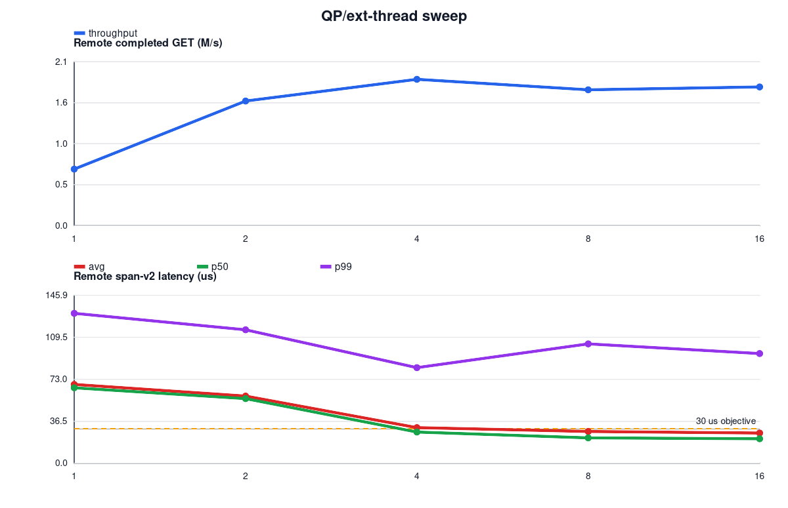
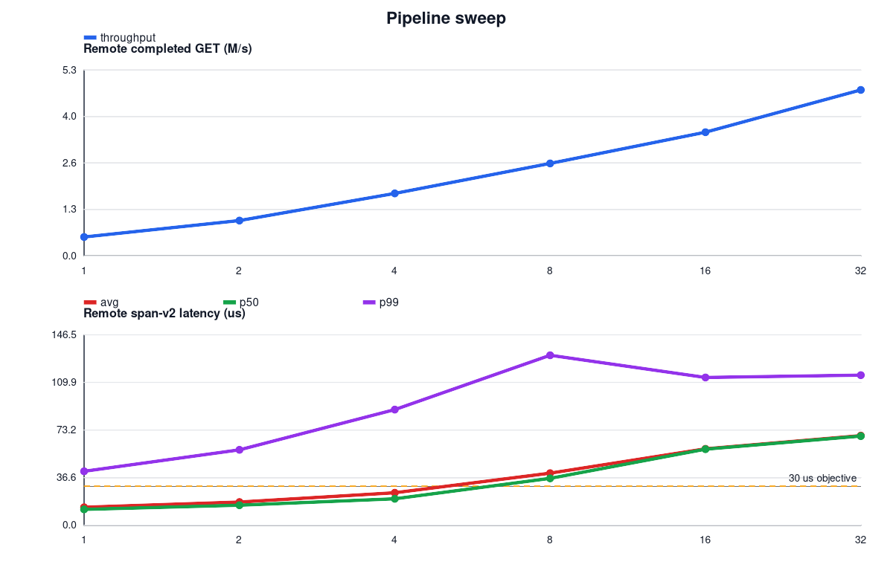
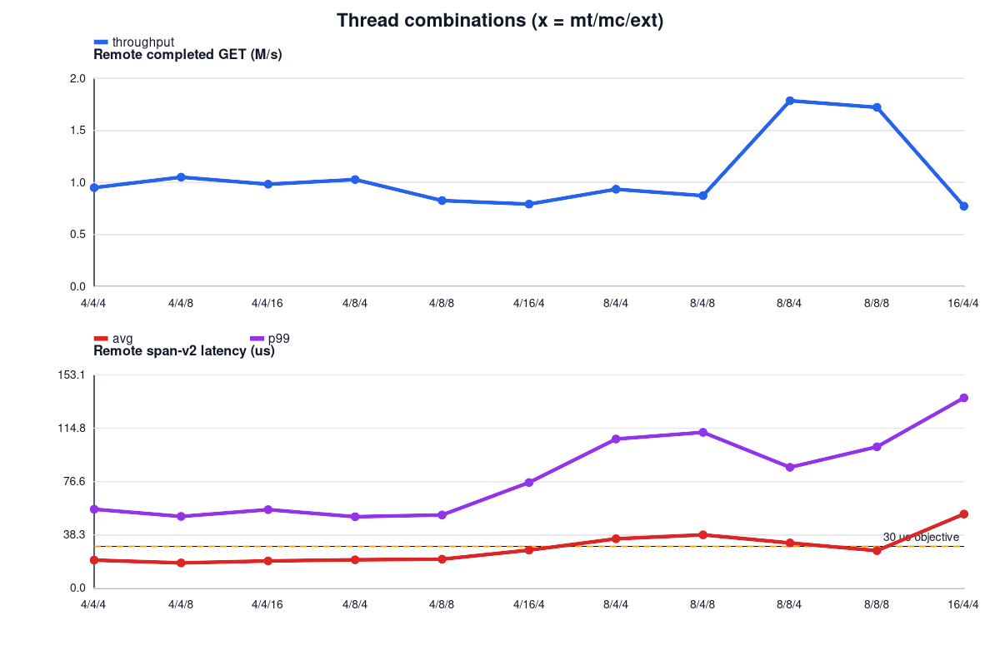
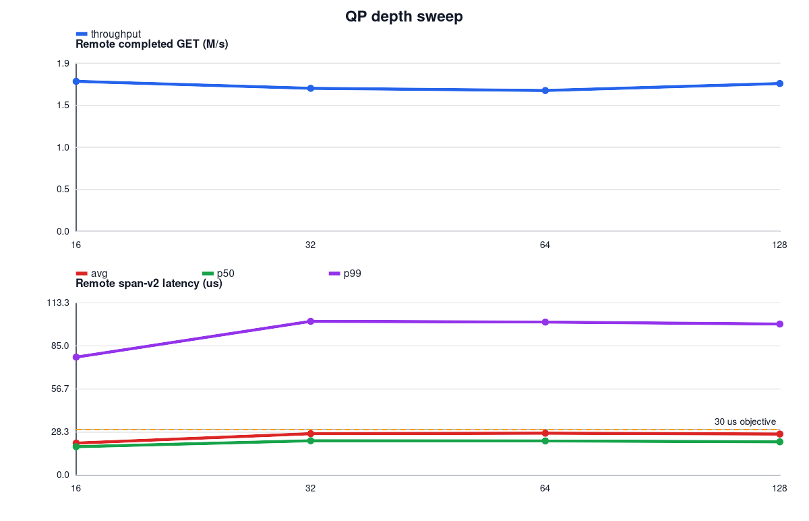
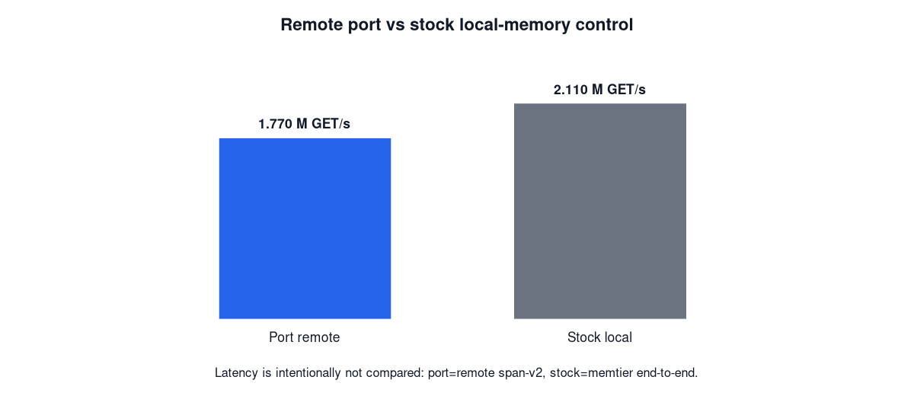

# QP / pipeline / thread / depth 10초 구성 스윕

측정일: 2026-07-24

## 측정 경계

| 항목 | 조건 |
|---|---|
| workload | GET-only, 64 B, 1,000,000 keys, point당 10초 |
| load generator | memtier, 16 clients/thread |
| Port security | AES-256-GCM ON |
| Port throughput | `extstore_prof_read_count / 10s`; `cmd_get / 10s`와 일치 확인 |
| Port latency | span-v2: RDMA READ post 직전 → CQE → shared/private sync → decrypt 완료 |
| Stock throughput | `cmd_get / 10s` |
| Stock latency | memtier end-to-end; Port remote span과 직접 비교하지 않음 |
| correctness | 모든 채택 point에서 miss, badcrc, RDMA failure, engine dead = 0 |

Port binary는 `564505f4…cf33`, stock은 `97ceee04…1d93`, memtier는
`bb7c5275…6b80`이다. 현 구현은 `ext_threads = QP = busy-poll IO thread`의
1:1 관계이므로 QP와 ext_threads를 독립적으로 바꿀 수 없다.

memtier의 마지막 `ALL STATS Ops/sec`는 일부 run에서 10초 progress 누적
count와 다른 분모를 사용했다. 따라서 throughput은 load 종료 시점의
`cmd_get`과 remote completion count를 10초로 나눈 값만 사용했다.

## 1. QP / ext_threads 스윕

고정값: mtT=8, mcT=8, clients/thread=16, pipeline=4, depth=64.

| QP=ext | remote GET M/s | avg µs | p50 µs | p99 µs | post→CQE µs | sync µs | decrypt µs |
|---:|---:|---:|---:|---:|---:|---:|---:|
| 1 | 0.715 | 68.496 | 65.600 | 130.300 | 46.265 | 4.499 | 0.673 |
| 2 | 1.577 | 58.392 | 56.200 | 116.000 | 39.035 | 4.283 | 0.662 |
| 4 | **1.851** | 30.991 | 27.100 | 83.100 | 18.578 | 3.333 | 0.754 |
| 8 | 1.718 | 27.589 | 22.100 | 103.700 | 16.158 | 3.558 | 0.814 |
| 16 | 1.755 | **26.249** | **21.300** | 95.300 | **15.227** | 3.430 | 0.815 |

QP=1–2에서는 pipeline=4의 요청이 소수 QP에 직렬 대기해 post→CQE와 전체
span이 함께 증가한다. QP=4에서 throughput이 최대지만 avg가 30µs를
0.991µs 초과한다. QP=8부터 avg `<30µs`를 충족하며, QP=16은 QP=8보다
throughput 이득이 2.1%뿐이고 IO thread를 8개 더 소비한다. 따라서
효율을 포함한 선택은 QP/ext=8이다.

## 2. Pipeline 스윕

고정값: mtT=8, mcT=8, clients/thread=16, QP/ext=8, depth=64.

| pipeline | remote GET M/s | avg µs | p50 µs | p99 µs | post→CQE µs | sync µs | decrypt µs |
|---:|---:|---:|---:|---:|---:|---:|---:|
| 1 | 0.534 | 13.852 | 12.200 | 41.500 | 7.913 | 2.414 | 0.914 |
| 2 | 1.001 | 17.857 | 15.400 | 58.000 | 10.023 | 2.855 | 0.859 |
| 4 | **1.770** | **25.011** | 20.400 | 89.000 | 14.506 | 3.334 | 0.800 |
| 8 | 2.621 | 40.071 | 36.100 | 130.800 | 24.447 | 4.250 | 0.803 |
| 16 | 3.506 | 58.820 | 58.500 | 113.700 | 37.470 | 5.294 | 0.814 |
| 32 | 4.704 | 68.925 | 68.600 | 115.500 | 45.597 | 5.782 | 0.767 |

pipeline 증가로 remote throughput은 계속 오르지만 queueing이 post→CQE에
누적된다. avg `<30µs`를 만족하는 최대 throughput point는 pipeline=4다.
p99 `<30µs`는 어느 point도 충족하지 못했다.

## 3. Thread 조합

고정값: clients/thread=16, pipeline=4, depth=64. 각 point에서 client는
상위 mtT개 CPU, server는 나머지 CPU 0–23을 사용했다. 따라서
`mtT + mcT + ext_threads <= 24`인 조합만 포함한다.

| mtT | mcT | QP=ext | CPU split client/server | remote GET M/s | avg µs | p50 µs | p99 µs |
|---:|---:|---:|---|---:|---:|---:|---:|
| 4 | 4 | 4 | 4 / 20 | 0.961 | 20.145 | 17.700 | 56.700 |
| 4 | 4 | 8 | 4 / 20 | 1.062 | **18.177** | **16.100** | 51.500 |
| 4 | 4 | 16 | 4 / 20 | 0.994 | 19.563 | 17.200 | 56.400 |
| 4 | 8 | 4 | 4 / 20 | 1.039 | 20.359 | 18.600 | **51.300** |
| 4 | 8 | 8 | 4 / 20 | 0.835 | 20.818 | 19.700 | 52.600 |
| 4 | 16 | 4 | 4 / 20 | 0.801 | 27.307 | 24.400 | 75.900 |
| 8 | 4 | 4 | 8 / 16 | 0.945 | 35.459 | 32.700 | 107.100 |
| 8 | 4 | 8 | 8 / 16 | 0.882 | 38.298 | 35.700 | 111.900 |
| 8 | 8 | 4 | 8 / 16 | **1.805** | 32.470 | 28.400 | 86.800 |
| 8 | 8 | 8 | 8 / 16 | **1.740** | **26.940** | **21.600** | 101.500 |
| 16 | 4 | 4 | 16 / 8 | 0.780 | 53.215 | 50.800 | 136.700 |

mtT=4는 server CPU를 늘려도 client가 약 1.06M/s에서 먼저 제한된다.
mtT=16은 client가 server에 8 CPU만 남겨 가장 느리다. 최고 throughput은
8/8/4지만 avg 32.470µs로 objective를 초과한다. avg `<30µs` 조건의 최고
throughput은 **mtT=8, mcT=8, QP/ext=8의 1.740M/s**다.

## 4. QP depth 스윕

고정값: mtT=8, mcT=8, clients/thread=16, QP/ext=8, pipeline=4.

| depth | remote GET M/s | avg µs | p50 µs | p99 µs | post→CQE µs | sync µs | decrypt µs |
|---:|---:|---:|---:|---:|---:|---:|---:|
| 16 | **1.737** | **21.048** | **18.700** | **77.600** | **11.551** | **3.161** | 0.817 |
| 32 | 1.656 | 27.259 | 22.600 | 101.200 | 15.728 | 3.620 | 0.850 |
| 64 | 1.632 | 27.603 | 22.500 | 100.700 | 15.781 | 3.679 | 0.857 |
| 128 | 1.711 | 27.057 | 21.900 | 99.400 | 15.744 | 3.524 | 0.822 |

이 workload의 pipeline=4에서는 depth=16이 충분하며, depth를 더 늘리면
throughput 이득 없이 queueing만 증가한다. 10초 quick-run 기준 최종
latency-qualified 설정은 **mtT=8, mcT=8, QP/ext=8, pipeline=4,
depth=16**이다.

## 5. Stock local-memory control

고정값: stock memcached mcT=8, memtier mtT=8×c16, pipeline=4.

| backend | completed GET M/s | latency 정의 | avg µs | p50 µs | p99 µs |
|---|---:|---|---:|---:|---:|
| Port remote, QP/ext=8 depth=64 | 1.770 | remote span-v2 | 25.011 | 20.400 | 89.000 |
| Stock local memory | **2.110** | memtier end-to-end | 241.200 | 223.000 | 439.000 |

throughput은 같은 10초 완료 GET 수라 비교할 수 있다. latency는 Port가
remote access 내부 span이고 stock이 client end-to-end이므로 같은 축의
우열로 해석하지 않는다.

## 결론

- QP/ext=8, pipeline=4, mtT=8, mcT=8은 avg `<30µs`에서 가장 높은
  thread 조합 throughput을 재현했다.
- depth는 64보다 16이 더 좋았다: 1.632→1.737M/s, avg
  27.603→21.048µs.
- throughput만 최대화하면 pipeline=32의 4.704M/s지만 avg 68.925µs로
  latency objective를 위반한다.
- 최종 quick-run 후보는 `mtT=8 × c16, mcT=8, QP/ext=8, pipeline=4,
  depth=16`이다. p99 `<30µs`는 달성하지 못했다.

## 재현물

- runner: `tools/config-matrix-10s.sh`
- plotter: `tools/plot-config-matrix.py`
- canonical CSV:
  `/home/seonung/2026/rdma-results/config-matrix-10s-20260724/results-canonical.csv`
- main raw:
  `/home/seonung/2026/rdma-results/config-matrix-10s-20260724/main/`
- corrected thread raw:
  `/home/seonung/2026/rdma-results/config-matrix-10s-20260724/threads-corrected-v2/`
