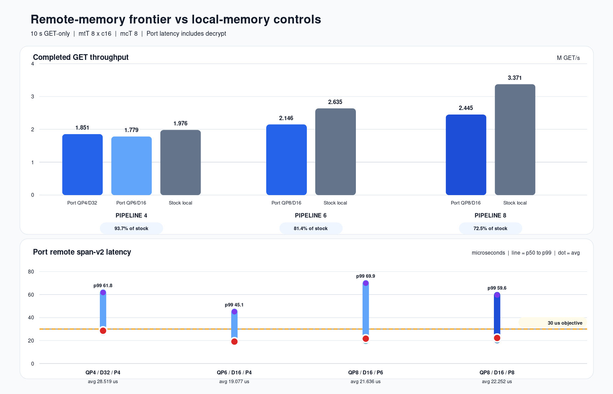
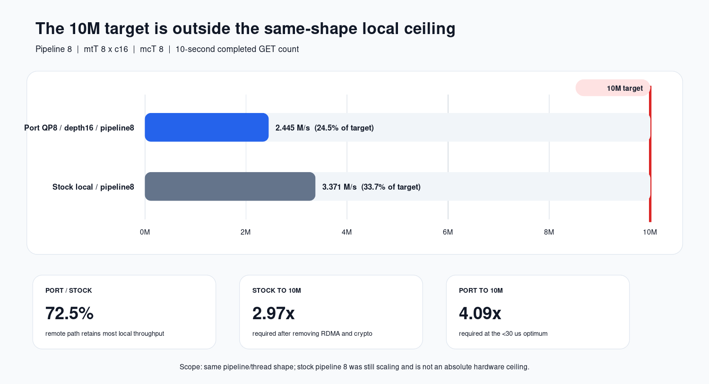

# `<30µs` Port frontier와 stock 동일-shape control

측정일: 2026-07-24

## 목적과 경계

기존 10초 구성 스윕에서 고른 Port 후보 4개와 stock local-memory
pipeline 4/6/8을 같은 환경에서 각각 10초 측정했다.

| 항목 | 조건 |
|---|---|
| workload | GET-only, 64 B, 1,000,000 preloaded keys |
| memtier | 8 threads × 16 clients/thread, CPU 16–23 |
| memcached | 8 workers, CPU 0–15 |
| Port throughput | remote completion count / 10초; `cmd_get`과 일치 |
| Port latency | span-v2: post → CQE → sync/private → decrypt 완료 |
| Stock throughput | `cmd_get / 10초` |
| Stock latency | memtier end-to-end; Port remote span과 직접 비교하지 않음 |
| correctness | 전 point miss, badcrc, RDMA failure, engine dead = 0 |

Port binary는 `564505f4…cf33`, stock은 `97ceee04…1d93`이다.

## Port 후보

| QP=ext | depth | pipeline | remote GET M/s | avg µs | p50 µs | p99 µs | post→CQE µs | sync µs | decrypt µs |
|---:|---:|---:|---:|---:|---:|---:|---:|---:|---:|
| 4 | 32 | 4 | 1.851 | 28.519 | 27.000 | 61.800 | 17.414 | 3.156 | 0.760 |
| 8 | 16 | 8 | **2.445** | 22.252 | 20.300 | 59.600 | 11.447 | 3.565 | 0.853 |
| 8 | 16 | 6 | 2.146 | 21.636 | 19.700 | 69.900 | 11.307 | 3.451 | 0.839 |
| 6 | 16 | 4 | 1.779 | **19.077** | **18.000** | **45.100** | **10.249** | **2.859** | 0.781 |

모든 후보가 avg `<30µs`를 충족했다. 처리량 최대점은
**QP/ext=8, depth=16, pipeline=8의 2.445M/s**다. 최소 latency/tail이
목표면 QP/ext=6, depth=16, pipeline=4가 더 낫다.

## Stock control

| pipeline | completed GET M/s | memtier avg µs | p50 µs | p99 µs |
|---:|---:|---:|---:|---:|
| 4 | 1.976 | 257.470 | 255.000 | 463.000 |
| 6 | 2.635 | 288.880 | 279.000 | 503.000 |
| 8 | **3.371** | 300.430 | 295.000 | 535.000 |

Stock latency는 client end-to-end이므로 위 Port remote span과 비교하지 않는다.
throughput은 같은 client/worker/pipeline과 동일한 10초 완료 GET 수라 비교할
수 있다.

## Pipeline별 Port / stock

| pipeline | Port 설정 | Port M/s | Stock M/s | Port / stock | stock까지 남은 gap |
|---:|---|---:|---:|---:|---:|
| 4 | QP4/depth32 | 1.851 | 1.976 | **93.65%** | 6.35% |
| 4 | QP6/depth16 | 1.779 | 1.976 | 89.99% | 10.01% |
| 6 | QP8/depth16 | 2.146 | 2.635 | 81.42% | 18.58% |
| 8 | QP8/depth16 | **2.445** | **3.371** | **72.54%** | 27.46% |

pipeline=4에서 Port는 local-memory stock 처리량의 93.65%에 도달했다. 높은
offered load의 pipeline=8에서도 72.54%다. Port 최적화가 동작하지 않는
상태라는 해석과 맞지 않으며, 동시에 high-concurrency remote engine에는
약 27%의 동일-shape gap이 남아 있다.

## 기존 optimal 대비

기존 `mtT=8, mcT=8, QP/ext=8, depth=64, pipeline=4`는 동일 설정으로
중복 측정된 네 point의 중앙값을 썼다.

| 설정 | remote GET M/s | avg µs | p99 µs |
|---|---:|---:|---:|
| 기존 optimal 중앙값 | 1.729 | 27.265 | 101.100 |
| 새 optimal: QP8/depth16/pipeline8 | **2.445** | **22.252** | **59.600** |
| 변화 | **+41.4%** | **-18.4%** | **-41.0%** |

depth를 줄여 post 이후 queueing을 제한했기 때문에 pipeline을 8로 올려도
remote span이 증가하지 않았다.

## 10M 목표 판정

| 대상 | 실측 M/s | 10M 대비 | 10M까지 필요한 배수 |
|---|---:|---:|---:|
| `<30µs` Port optimal | 2.445 | 24.45% | 4.09× |
| 동일 pipeline=8 stock local | 3.371 | 33.71% | 2.97× |

따라서 **현재 mtT=8×c16, mcT=8, pipeline=8, 24-vCPU shape에서 10M은
Port 최적화 품질을 판정하는 공정한 목표가 아니다.** remote memory,
sync, AES-GCM을 전부 제거한 stock local control도 3.371M/s이므로 같은
operating point에서 10M에 도달할 수 없다.

이 결론은 동일 shape의 실측 상한에 대한 것이다. stock throughput이
pipeline 4→6→8에서 계속 증가했으므로 3.371M/s를 전체 하드웨어의 절대
포화 상한으로 해석하지 않는다. 다른 worker 수, 더 높은 pipeline,
off-box client까지 포함한 환경 전체의 10M 불가를 주장하려면 별도 stock
saturation sweep이 필요하다.

## 재현물

- runner: `tools/config-matrix-10s.sh` (`PHASES=frontier`)
- plotter: `tools/plot-config-matrix.py`
- raw:
  `/home/seonung/2026/rdma-results/frontier-7point-20260724/`
